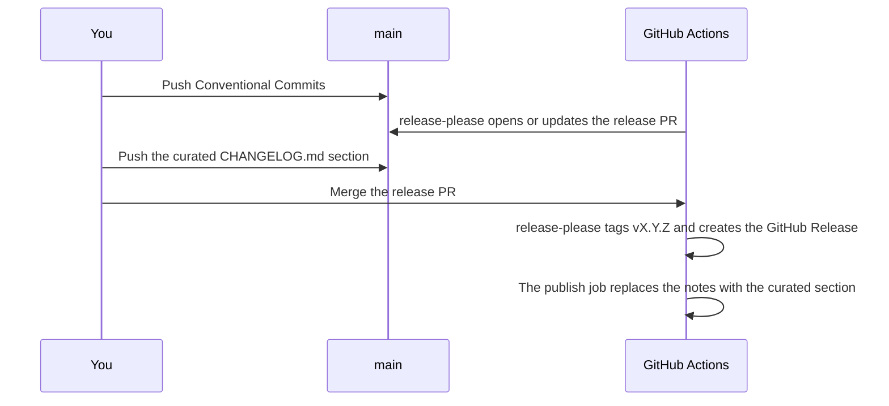

# Releases

Release with an agent: run [`{{prefix}}-release`](../.agents/skills/{{prefix}}-release/SKILL.md). It asks for approval
before it merges the release PR.

This page is the process that skill follows, and every step can also be run by hand.



## Versioning

[release-please](https://github.com/googleapis/release-please) reads [Conventional Commits](https://www.conventionalcommits.org/)
on `main` and keeps one release PR open that bumps
[`.github/.release-please-manifest.json`](../.github/.release-please-manifest.json). Before `1.0.0`, a breaking change and
`feat` bump the minor version, and `fix` the patch version. A `Release-As: X.Y.Z` footer in a commit body forces the next
version.

`CHANGELOG.md` is written by hand. release-please never edits it (`skip-changelog` in
[`.github/release-please-config.json`](../.github/release-please-config.json)).

## Prepare the release commit

Read the proposed version from the release PR title. Curate its `CHANGELOG.md` section with
[`{{prefix}}-changelog`](../.agents/skills/{{prefix}}-changelog/references/curated-release.md) in release mode:
highlights by impact, the trimmed log below them, and the heading date set to the release day. The version in the heading
must match the release PR.

{{release_assets}}

Check and push it to `main`, staging any release assets with the changelog:

```sh
{{lint_docs}}
{{check}}
git add CHANGELOG.md
git commit -m "docs: prepare the <version> release"
git push origin main
```

release-please force-pushes its PR branch on every run, so commits added to that branch are lost. The curated section lives
on `main`.

## Merge the release PR

release-please opens its PR with `GITHUB_TOKEN`, so CI does not run on it. The curated commit's CI run on `main` covers the
release; merge once it is green:

```sh
gh pr list --label "autorelease: pending"
gh pr merge <number> --squash
```

The merge starts [`release.yml`](../.github/workflows/release.yml). release-please tags `v<version>` and creates the GitHub
Release. {{publish}} The job fails when the section is missing.

## Verify

```sh
gh run list --workflow release.yml --limit 1
gh release view v<version>
```

The release notes must match the curated section.

{{verify_install}}
