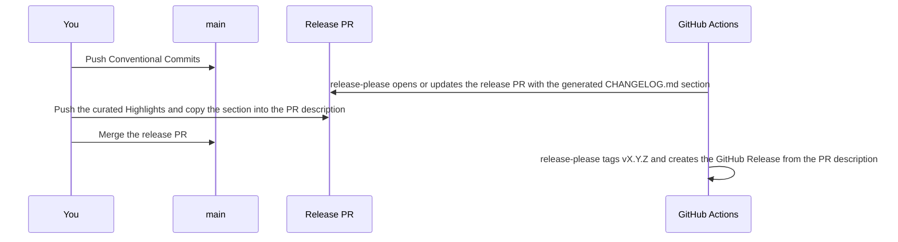

# Releases

Release with an agent: run [`repo-release`](../.agents/skills/repo-release/SKILL.md). It asks for approval
before it merges the release PR.

This page is the process that skill follows, and every step can also be run by hand.



## Versioning

[release-please](https://github.com/googleapis/release-please) reads [Conventional Commits](https://www.conventionalcommits.org/)
on `main` and keeps one release PR open that bumps
[`.github/.release-please-manifest.json`](../.github/.release-please-manifest.json). Before `1.0.0`, a breaking change and
`feat` bump the minor version, and `fix` the patch version. A `Release-As: X.Y.Z` footer in a commit body forces the next
version.

## Changelog

release-please writes each release section of `CHANGELOG.md` in the release PR: a heading with the version, compare link,
and date, then the commits grouped by the `changelog-sections` in
[`.github/release-please-config.json`](../.github/release-please-config.json). It inserts the new section above the first
heading that starts with `## [` or `## <digit>`, so every release heading keeps that format.

The curated `### Highlights` go directly under the heading, above the generated groups. release-please publishes the
release PR description as the GitHub Release notes, so the description carries the same section and the release page
matches `CHANGELOG.md`.

## Prepare the release

Every push to `main` makes release-please rebuild the release PR branch and its description, which drops anything added to
them. Push everything for the release first, wait for release-please to finish its run, then curate and merge without
pushing to `main` in between.

Read the version from the release PR title and check out its branch:

```sh
gh pr list --label "autorelease: pending"
gh pr checkout <number>
```

Write the Highlights with
[`repo-changelog`](../.agents/skills/repo-changelog/references/curated-release.md).

{{release_assets}}

Check and push the release branch, staging any release assets with the changelog:

```sh
{{lint_docs}}
{{check}}
git add CHANGELOG.md
git commit -m "docs: curate the <version> release notes"
git push
```

The push runs CI on the release PR. Copy the section into the PR description, keeping release-please's header line, the
`---` lines around the notes, and its footer:

```sh
gh pr edit <number> --body-file <file>
```

## Merge the release PR

Merge once CI on the release PR is green:

```sh
gh pr merge <number> --squash
```

The merge starts [`release.yml`](../.github/workflows/release.yml). release-please tags `v<version>` and creates the GitHub
Release with the PR description as its notes. {{publish}}

## Verify

```sh
gh run list --workflow release.yml --limit 1
gh release view v<version>
```

The release notes must match the version's `CHANGELOG.md` section.

{{verify_install}}
