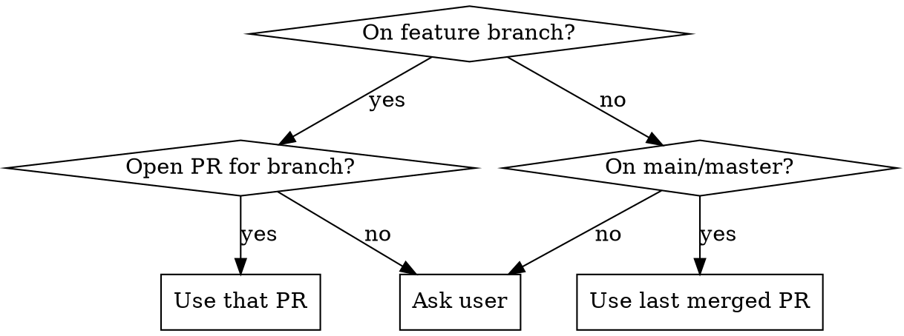

# PR Knowledge Sync

Sync project knowledge artifacts to code changes from a PR.

## Context

Current branch: !`git branch --show-current`
Recent PRs: !`gh pr list --state merged --limit 3 --json number,title,mergedAt,headRefName --template '{{range .}}#{{.number}} {{.title}} ({{.headRefName}}, {{.mergedAt}}){{"\n"}}{{end}}' 2>/dev/null || echo "No gh CLI or no PRs found"`

## Step 1: Identify the PR

$ARGUMENTS

**Auto-detection logic (when no argument given):**



Commands:
- Current branch PR: `gh pr view --json number,title,body,files`
- Last merged PR: `gh pr list --state merged --limit 1 --json number,title,headRefName`
- Specific PR: `gh pr view <number> --json number,title,body,files`

## Step 2: Analyze the diff

Get the full diff of the PR:

```bash
gh pr diff <number>
```

Categorize changes:
- **Structural**: new files/dirs, moved files, deleted files, renamed exports
- **Behavioral**: new commands, changed APIs, modified workflows, new dependencies
- **Configuration**: env vars, build config, CI changes
- **Patterns**: new conventions introduced, existing conventions changed

## Step 3: Scan knowledge artifacts

Check each project-scoped knowledge file against the diff. These are the artifact types to review:

| Artifact | Location | What to check |
|-|-|-|
| Project CLAUDE.md | `./CLAUDE.md` or `.claude/CLAUDE.md` | Commands, structure, architecture, env vars |
| Skills | `.claude/skills/` | Conventions, patterns, references, examples |
| Hooks | `.claude/hooks/` | Enforcement rules matching changed patterns |
| README / docs | `*.md` in project root | Setup instructions, API docs, usage guides |

For each artifact, ask:
1. Does the PR **invalidate** anything stated here? (stale content)
2. Does the PR **add** something that should be documented here? (gap)
3. Does the PR **change** a pattern this artifact describes? (drift)

## Step 4: Propose changes

Present findings as a table before making any edits:

```
| File | Issue | Action |
|-|-|-|
| CLAUDE.md:L42 | New `foo` command not documented | Add to Commands section |
| skills/dev-react/... | New pattern introduced in PR | Add section |
| README.md:L15 | Setup step changed | Update instructions |
```

Wait for user confirmation before proceeding.

## Step 5: Apply updates

Edit each file. Keep changes minimal and focused — match the existing style of each artifact.

After all edits, create a single commit:

```
docs: sync project knowledge to PR #<number>
```

## Rules

- **Project-scoped only** — never touch global/user-level config files
- **Minimal edits** — update what's stale, don't rewrite what's fine
- **Match existing style** — each artifact has its own voice and format
- **No speculation** — only document what the PR actually changed, not what it might change next
- **Ask when uncertain** — if you're unsure whether something needs updating, ask rather than guess
