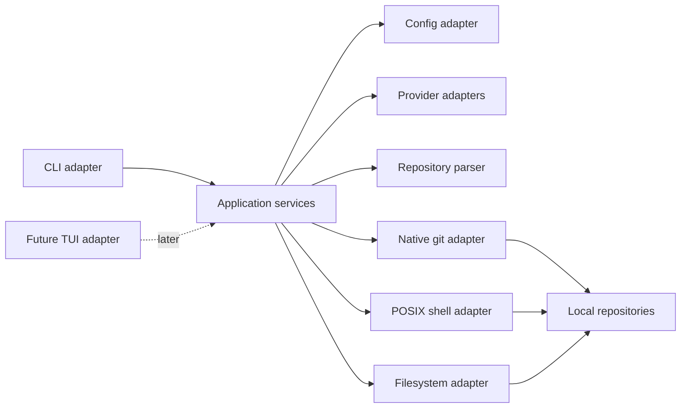

# Standalone ensure-cloned CLI plan

## Context

Create a new local Git repository at `~/repos/nikbrunner/lager`, published as `github.com/nikbrunner/lager`, for a small compiled CLI that keeps a declared set of Git repositories cloned locally. Helm is product-history context only: the new tool has its own name, config, release path, and implementation.

The first release covers a declarative clone registry, config CRUD, ensure-all reconciliation, per-repository post-clone commands, interactive prompts, fuzzy repository selection backed by the installed `fzf` executable, and guarded permanent repository deletion. It officially supports macOS and Linux on x86_64 and ARM64. Fleet branch/dirty/ahead status, pull, push, dirty-repo traversal, and rebuild are out of scope. It must preserve native Git and post-clone output and errors rather than replacing them with summaries.

Rollout runs Lager beside Helm: create `common/.config/lager/config.toml`, link it to `~/.config/lager/config.toml`, add `github:nikbrunner/lager` to mise, and copy the current `ensure_cloned` declarations into Lager TOML. Helm remains intact during the trial; do not run both tools concurrently against the same missing destination.

## Approach

Use a small ports-and-adapters structure. Domain and application services expose typed operations and outcomes; the CLI adapter owns argument parsing, `cliclack`, `fzf`, and terminal rendering. Git, provider APIs, config persistence, shell execution, and filesystem deletion sit behind narrow infrastructure adapters. A future TUI can call the same application services without invoking CLI commands or parsing terminal text.



### Command contract

Global flags: `--config <PATH>` overrides `LAGER_CONFIG` and the default config; `--help` and `--version` follow Clap conventions. Clap help describes every command, argument, and flag and includes focused examples for chaining and permanent removal.

| Command            | Arguments and flags                                                                     | Contract                                                                                                                                                                      |
| ------------------ | --------------------------------------------------------------------------------------- | ----------------------------------------------------------------------------------------------------------------------------------------------------------------------------- |
| `lager init`       | `--root <PATH>`; `--create-root` / `--no-create-root`; `--github` / `--no-github`       | Create config, never overwrite. All three choices are required outside a TTY.                                                                                                 |
| `lager register`   | `[REPO]...`; `--post-clone <CMD>`; `--include-archived`                                 | Register/re-enable declarations only. With no repo, open the provider picker. One explicit hook applies to every batch item.                                                  |
| `lager unregister` | `[REPO]...`; `--include-archived`                                                       | Unregister/exclude declarations only. With no repo, pick explicit and expanded wildcard members.                                                                              |
| `lager add`        | `[REPO]...`; `--register` / `--no-register`; `--post-clone <CMD>`; `--include-archived` | Clone to exact destinations, then optionally register. Register intent is required outside a TTY; `--post-clone` implies `--register` and conflicts with `--no-register`.     |
| `lager remove`     | `[REPO]...`; `--unregister` / `--keep-registered`; `--yes`; `--force`                   | Permanently remove guarded standalone clones, then optionally clean config. Non-TTY requires unregister/keep-registered plus `--yes`; `--force` bypasses only state warnings. |
| `lager ensure`     | `--include-archived`                                                                    | Sequentially clone all missing effective declarations and run fresh-clone hooks.                                                                                              |
| `lager hook`       | `<REPO>...`                                                                             | Rerun configured hooks for one or more explicit declarations; no picker.                                                                                                      |
| `lager list`       | `--remote`; `--include-archived` (requires `--remote`); `--json`                        | Offline declarations/state by default; remote effective expansion on request. Only this command has stable JSON.                                                              |

TTY repository pickers use `fzf --multi`: Enter selects one row, Tab marks several. Repeated positional repositories are the non-interactive batch equivalent.

### Core behavior

- Normalize GitHub, Bitbucket Cloud, Bitbucket Data Center, and generic clone references into typed host/path identities.
- Map GitHub to `root/owner/repo`, configured hosts to `root/prefix/remote-path`, and unknown hosts to `root/host/full-remote-path`.
- Accept an existing destination only when it is a real standalone Git directory with a matching normalized `origin`; reject conflicts without mutation.
- Create safe parent directories and invoke installed `git` with inherited stdin/stdout/stderr. The first clone/ensure may create a root skipped by init.
- Run hooks only after fresh clone plus successful persistence, or through `lager hook`; execute fixed `/bin/sh -c` in the repository with inherited streams/environment.
- Preserve clones/declarations after hook failure and store no hook-completion state.

### Config mutation

- Register/unregister are idempotent: already managed/unmanaged is a visible exit-0 no-op.
- Conflicting explicit duplicates fail config validation.
- Unregistering a wildcard member adds its provider-relative name to every matching `exclude` list.
- Unregistering an explicit/wildcard overlap deletes the explicit table and adds all matching exclusions atomically.
- Re-registering an excluded wildcard member removes matching exclusions; create an explicit table only when it needs `post_clone`.
- Matching existing clones still honor register intent. Missing remove targets still honor unregister intent without a disk prompt.

### Deletion safety

- Delete only standalone non-bare clones with a real `.git/` directory; reject symlinks, linked worktrees, bare repositories, and unreadable/conflicting paths.
- Always enforce canonical root boundaries and normalized `origin` identity, including with `--force`.
- Treat tracked/untracked changes, ignored paths, stashes, dirty submodules, detached/local commits absent from remote-tracking refs, and unsafe branch tips as warnings requiring skip/force.
- Show and confirm each existing target path in a TTY. Non-TTY requires `--yes`; `--force` bypasses warnings, not identity/boundary checks.
- Remove with Rust's recursive filesystem API. Failed/partial disk removal leaves config unchanged.

### Interaction and batches

- Repository arguments bypass `fzf`; all batches run sequentially, continue after independent failures, list failures, and return aggregate status.
- No-arg candidates: register = active undeclared provider repos; add = active provider repos absent at exact destinations; unregister = explicit plus expanded wildcard members; remove = standalone clones under root.
- `cliclack` defaults: register hook `No`; post-add register `Yes`; post-remove unregister `Yes`; unsafe remove `skip` or `force`.
- Multi-add prompts for register/hook per successful repository. Explicit batch `--post-clone` applies one command to all arguments.
- Provider failures retain successful candidates but force exit 1. All-provider register/add failure skips `fzf`; unregister may still show offline explicit declarations.
- A provider-backed picker/remote expansion with no configured providers is exit 1; explicit commands and offline list still work. A successful empty candidate set is exit 0.
- Esc/Ctrl-C is exit 130; invalid/contradictory flags are exit 2 before mutation.

### Runtime and dependencies

- Stable Rust, one library plus one `lager` binary.
- Rust crates: `clap`, `cliclack`, `serde`, `toml_edit`, blocking `reqwest` + Rustls/system roots, `serde_json`, `directories`, `fs2`, `walkdir`, `thiserror`.
- Process boundaries: installed `git`, authenticated `gh`, installed `fzf`, fixed `/bin/sh -c`.
- Check each external tool only when its feature runs; init reports missing tools but still writes config.
- Config precedence: `--config` > `LAGER_CONFIG` > `~/.config/lager/config.toml`; `LAGER_CACHE_DIR` isolates test locks.

### Providers and wildcards

- Configured `[providers]` entries are the discovery allowlist; init offers only the default GitHub entry. Bitbucket tables are edited directly.
- `src/application/ports.rs` defines the provider abstraction: `catalog(include_archived)` and `expand(wildcard, include_archived)` return normalized candidates/errors.
- `src/infrastructure/providers/*.rs` are outbound implementations of that port: GitHub/GitHub Enterprise via `gh`; Bitbucket Cloud/Data Center via REST with anonymous, bearer, or basic auth. Secrets come only from named environment variables.
- Fully paginate every catalog/wildcard request. Filter archived repos by default; `--include-archived` includes and labels them.
- Allow only trailing `/*`; reject wildcard `post_clone`; apply relative `exclude` lists.
- Deduplicate expanded identities in declaration order; explicit declarations win, then the first wildcard wins.
- Clone authentication remains native Git/SSH.

### Output and exit codes

- Preserve native Git/hook stdin/stdout/stderr. Mutations add only human summaries.
- Stable machine output exists only for `list --json`: one versioned JSON document on stdout, warnings on stderr.
- Concrete list fields: identity, clone URL, source, resolved destination, hook presence, and `missing|cloned|conflict|unreadable`.
- Offline wildcard rows contain pattern/exclusions; `--remote` emits effective concrete rows plus separate provider errors.
- Exit codes: `0` success/no-op/empty/skip; `1` config/operation/provider/aggregate failure; `2` usage; `130` cancellation.

The config schema is:

```toml
root = "~/repos"

[providers."github.com"]
preset = "github"
prefix = ""

[providers."git.example.com"]
preset = "bitbucket-data-center"
prefix = "company"
api_url = "https://git.example.com"
auth = "bearer"
token_env = "BITBUCKET_DC_TOKEN"
ssh_user = "git"
ssh_port = 7999

[[repositories]]
url = "git@github.com:nikbrunner/dots"

[[repositories]]
url = "git@github.com:black-atom-industries/*"
exclude = ["archived-repo"]

[[repositories]]
url = "git@github.com:black-atom-industries/helm.tmux"
post_clone = "make install"
```

### Config invariants

- Config order controls display and sequential ensure scheduling.
- Warn on and preserve unknown keys; reject invalid recognized values before external operations.
- Reject persisted absolute paths and `..`; resolve `~`, `~/…`, and bare roots from HOME. Prefixes/exclusions must stay below their owner.
- Resolve config-file symlink chains. Reads rely on atomicity; writers take a cache-hosted exclusive lock, edit with `toml_edit`, sync a same-directory temp file, preserve permissions, rename the final target, and leave logical symlinks intact.

### Repository references

- Accept SCP SSH, `ssh://` with ports, HTTP(S) clone URLs, known-provider browser URLs, `host/namespace/repo`, and GitHub-only `owner/repo` shorthand.
- Preserve unambiguous clone URL transport. Materialize browser/catalog/canonical/shorthand input as provider SSH URLs.
- SSH defaults: `git@github.com:path.git`, `git@bitbucket.org:path.git`, Data Center `ssh://git@host:7999/path.git`; Data Center permits `ssh_user`/`ssh_port` overrides.
- Known presets parse explicit refs without provider entries. Canonical IDs require a preset; unknown hosts require full clone URLs and get no catalog/wildcard support.
- Normalize host/path for duplicate checks, destination lookup, remote validation, and wildcard matching while preserving stored URL text.

### Release contract

- Public MIT repository: `github.com/nikbrunner/lager`; source install: `cargo install --git https://github.com/nikbrunner/lager --locked`.
- Release-please Rust strategy bootstraps `v0.1.0`; later releases follow Conventional Commits.
- Assets: `lager-v{version}-{target}.tar.gz` containing root-level `lager` for `aarch64-apple-darwin`, `x86_64-apple-darwin`, `aarch64-unknown-linux-musl`, and `x86_64-unknown-linux-musl`.
- Publish `SHA256SUMS` and GitHub provenance attestations; support clobber-safe manual tag retry.
- Bare mise entry `github:nikbrunner/lager` must auto-select and install every platform asset before dots migration.

## Files to modify

New repository structure:

```text
../lager/
├── .github/
│   ├── .release-please-manifest.json
│   ├── release-please-config.json
│   └── workflows/
│       ├── ci.yml
│       └── release.yml
├── src/
│   ├── application/
│   │   ├── mod.rs
│   │   ├── ports.rs
│   │   ├── registry.rs
│   │   └── warehouse.rs
│   ├── cli/
│   │   ├── args.rs
│   │   ├── controller.rs
│   │   ├── interaction.rs
│   │   ├── mod.rs
│   │   └── render.rs
│   ├── domain/
│   │   ├── config.rs
│   │   ├── mod.rs
│   │   ├── repository.rs
│   │   └── state.rs
│   ├── infrastructure/
│   │   ├── providers/
│   │   │   ├── bitbucket_cloud.rs
│   │   │   ├── bitbucket_data_center.rs
│   │   │   ├── github.rs
│   │   │   └── mod.rs
│   │   ├── config.rs
│   │   ├── filesystem.rs
│   │   ├── fzf.rs
│   │   ├── git.rs
│   │   ├── mod.rs
│   │   └── shell.rs
│   ├── lib.rs
│   └── main.rs
├── tests/
│   ├── support/
│   │   ├── git.rs
│   │   ├── http.rs
│   │   ├── mod.rs
│   │   └── shim.rs
│   ├── e2e.rs
│   └── providers_e2e.rs
├── .gitignore
├── AGENTS.md
├── Cargo.lock
├── Cargo.toml
├── CHANGELOG.md
├── LICENSE
├── README.md
└── lefthook.yml
```

Dots rollout files:

| Path                                                   | Change                                                                                   |
| ------------------------------------------------------ | ---------------------------------------------------------------------------------------- |
| `common/.config/lager/config.toml`                     | Add GitHub provider, 14 explicit repos, one wildcard, and five hooks using four commands |
| `common/.config/black-atom/helm-tmux/config.yml:21-41` | Keep the existing `ensure_cloned` inventory intact for side-by-side use                  |
| `common/.config/mise/config.toml`                      | Add `github:nikbrunner/lager` after release smoke tests                                  |
| `symlinks.yml`                                         | Link the Lager config file to `~/.config/lager/config.toml`                              |

## Reuse

No Helm source will be copied or imported. Its behavior is evidence for decisions:

- `common/.config/black-atom/helm-tmux/config.yml:21-41` — migration source: nine plain personal repositories, five explicit repositories with four distinct post-clone commands, and the `black-atom-industries/*` wildcard. The explicit Helm/Shiplog entries overlap that wildcard and exercise explicit precedence.
- `../../black-atom-industries/helm/cmd/helm/setup.go` — current ensure workflow, four-way clone concurrency, wildcard expansion through `gh`, destination selection, and post-clone execution
- `../../black-atom-industries/helm/internal/config/user_config.go` — current scalar-or-object YAML entry decoding
- `../../black-atom-industries/helm/cmd/helm/repos.go` — current command vocabulary and hidden-output failure mode
- `../../black-atom-industries/helm/internal/git/repo.go` — current subprocess boundaries; `Output()` and `Run()` without inherited streams explain why native Git diagnostics disappear
- `../../black-atom-industries/helm/internal/git/remote.go` — existing SSH/HTTPS normalization is too narrow to serve as the new parser
- `../../black-atom-industries/helm/internal/git/remote_test.go` — useful URL-form examples, not reusable implementation

The standalone tool should depend on the system `git` binary rather than implementing Git transport itself.

Provider preset findings:

- Helm currently authenticates GitHub wildcard listing through `gh auth status` / `gh repo list`; Git clone authentication remains native SSH. It has no Bitbucket listing or API credential path.
- GitHub full discovery uses `gh api graphql --paginate` over `viewer.repositories`; organization wildcards use the scoped repository listing and clone URL fields.
- Bitbucket Cloud full discovery lists accessible workspaces then each workspace's repositories; workspace wildcards call `GET /2.0/repositories/{workspace}`, follow opaque `next` URLs, and use returned clone links plus `full_name`.
- Bitbucket Data Center full discovery calls the paginated `GET /rest/api/1.0/repos`; project wildcards call `GET /rest/api/1.0/projects/{projectKey}/repos`, follow `nextPageStart`, and represent personal projects as `~user`.
- The current Helm path behavior maps GitHub to `owner/repo`, configured Data Center hosts to `alias/project/repo`, strips a leading `~` only for the local path, and prefixes unknown hosts with the hostname. These rules become assertions in preset tests.

Current library research:

- [`cliclack`](https://docs.rs/cliclack/latest/cliclack/) provides confirm, select, multiselect, input, styled messages, filtering, and cancellation.
- [`fzf`](https://github.com/junegunn/fzf) has a stable stdin/stdout subprocess contract and is packaged by Homebrew, mise, and Arch. An embedded picker would duplicate a mature tool Nik already accepts as a dependency.

Release references:

- [release-please Rust strategy](https://github.com/googleapis/release-please/blob/main/docs/customizing.md)
- [release-please action outputs and release asset upload](https://github.com/googleapis/release-please-action)

Official provider references:

- [GitHub repository REST API](https://docs.github.com/en/rest/repos/repos)
- [Bitbucket Cloud repository REST API](https://developer.atlassian.com/cloud/bitbucket/rest/api-group-repositories/)
- [Bitbucket Data Center REST API](https://developer.atlassian.com/server/bitbucket/rest/)

## Steps

- [x] Scaffold one stable-Rust library/binary package at `~/repos/nikbrunner/lager` with the planned module boundaries, MIT license, lean `AGENTS.md`, README, formatting/Clippy settings, and Lefthook split checks.
- [x] Start with a failing flag-driven binary tracer test that clones an explicit local bare remote into its exact computed destination; add only enough parser, path resolver, native Git adapter, service, and CLI wiring to pass.
- [x] Grow repository parsing, provider-specific normalization, destination collision checks, and local state classification as vertical red-green slices.
- [x] Implement init plus symlink-aware, preserving, locked TOML reads/mutations; cover idempotent register/unregister, wildcard exclusions/re-enablement, warnings, and config chaining.
- [x] Implement sequential add/ensure/hook services with inherited Git/shell streams, fresh-clone hook rules, no-op chaining, aggregate outcomes, and injected ports reusable by another UI.
- [x] Implement offline/versioned list output, remote effective expansion, contextual `fzf --multi` pickers, repeated positional batches, archived filtering, and fake-interaction tests without PTY automation.
- [x] Implement the three `ProviderCatalog` adapters with focused contract tests, then add `tests/providers_e2e.rs` scenarios that invoke the built binary through catalog selection and wildcard ensure/list flows.
- [x] Implement guarded standalone-clone removal with boundary/origin checks, all agreed local-state warnings, force/confirmation separation, and config cleanup after success or disk absence.
- [x] Complete hermetic binary E2E coverage, CI on Linux/macOS, user/automation/provider documentation, release config, and the retryable four-target artifact workflow.
- [x] After all gates pass, request approval for repository settings and the first commit/push; publish public `nikbrunner/lager`, merge release-please's bootstrap PR, and produce `v0.1.0` with checksums and attestations.
- [x] Smoke-test every `v0.1.0` archive through mise, then copy the 14 explicit declarations, wildcard, and hooks into `common/.config/lager/config.toml` and link/install it through dots while keeping Helm intact for side-by-side use.
- [x] Create a public follow-up issue for validating Bitbucket Data Center catalog authentication against a private deployment, covering anonymous/bearer/basic discovery, wildcard expansion, path mapping, and docs without naming ImFusion or its host.

## Verification

- Run `cargo fmt --check`, `cargo clippy --all-targets --all-features -- -D warnings`, `cargo test --all-targets`, `cargo test --test e2e`, and `cargo test --test providers_e2e` locally and in CI.
- Run CI on macOS and Linux; keep provider contracts and binary E2E inside the normal Cargo test suite.
- In a disposable repository, run `lefthook install`, `lefthook run pre-commit`, and `lefthook run pre-push`; prove representative failures block without modifying or staging files.
- Give each E2E case an isolated temporary `HOME`, config root, repository root, and `PATH`; prohibit outbound network access.
- Use local bare repositories for real Git clone/state behavior, local HTTP fixtures for all provider pagination/auth responses, and controllable executable shims where exact stdout/stderr/exit behavior must be asserted.
- Exercise SCP SSH, `ssh://` with ports, HTTP(S) clone URLs, provider browser URLs, canonical host/path IDs, and GitHub shorthand for GitHub, Bitbucket Cloud, and Data Center, including malformed and ambiguous input.
- Reject wildcard entries with `post_clone` before any provider or Git subprocess runs.
- Verify wildcard exclusions, explicit-over-wildcard precedence, duplicate expansion, unregister/remove exclusion behavior, register re-enablement, and hook-driven explicit declarations for wildcard-derived repositories.
- Run init/register/unregister/add/remove/list/ensure/hook against temporary config and repository directories, including repeated idempotent CRUD and conflicting duplicate definitions.
- Confirm unknown TOML keys warn on stderr without corrupting JSON stdout, survive mutations byte-for-byte outside touched tables, and do not block commands; invalid recognized values fail before external operations.
- Exercise direct, relative, multi-hop, and dangling config symlinks; prove mutations replace only the final target, preserve permissions/logical links, use cache-hosted locks, and serialize concurrent writers without partial TOML.
- Confirm `init --root … (--create-root|--no-create-root) (--github|--no-github)` reports missing dependencies without failing, refuses overwrite, accepts an existing root untouched, and creates or leaves a missing root according to intent; cover matching wizard decisions through the fake interaction adapter.
- Confirm explicit-reference commands work without `fzf`/`gh`, while picker/wildcard features fail with targeted install or login guidance.
- Reject forbidden absolute or escaping persisted paths; confirm `repos` and `~/repos` resolve from temporary HOME rather than cwd and remain portable across homes.
- Confirm `remove` cannot escape the configured repository root and refuses linked worktrees and bare repositories without mutation.
- Confirm every existing-target TTY remove shows its exact path and prompts, while an absent target goes directly to config cleanup; non-TTY remove rejects missing `--yes`; tracked, untracked, ignored, stashed, dirty-submodule, detached, no-upstream, and unpushed states offer `skip`/`force`; skipped repositories remain untouched/configured; and forced removal still validates path and repository identity.
- Confirm native clone and post-clone progress, authentication prompts, warnings, and error text reach the terminal unchanged and never interleave across repositories.
- Confirm interactive multi-selection collects hooks independently while batch `--post-clone` applies one exact command to every argument; both paths persist exact command text; clone-time hooks run in the repository directory only after a successful new clone and persistence, while explicit `hook` reruns them. A failed hook preserves the clone and declaration while returning non-zero.
- Confirm default `list` performs no network/provider subprocess calls and shows explicit destination states plus dynamic wildcard rows; `--remote` shows only expanded effective declarations after exclusions and deduplication.
- Confirm `list --json` emits one documented JSON object without decoration and remains stable across TTY/non-TTY use.
- Confirm success/no-op/empty candidates/explicit skip exits `0`, missing providers plus config/operation/provider/aggregate failures exit `1`, invalid usage exits `2`, and Esc/Ctrl-C exits `130`.
- Confirm through prompt-adapter tests that questions appear only on a TTY and default to persisting add/remove changes; prove every behavior end-to-end through explicit non-interactive flags.
- Confirm non-TTY add/remove reject missing or contradictory chaining flags before changing disk.
- Confirm compiled top-level and command-specific Clap help describes every public command, argument, and flag with focused chaining/removal examples; shell completions and man pages remain outside v1.
- In `tests/providers_e2e.rs`, invoke the built binary for every preset, never adapter methods directly.
- GitHub E2E: use `gh` and `fzf` PATH shims plus Git URL rewrites to local bare remotes; run no-arg `add --no-register`, wildcard `ensure`, and `list --remote --json`; assert exact `gh api --paginate` calls, multi-page parsing, candidate filtering, destination paths, clones, JSON, and exits.
- Bitbucket Cloud/Data Center E2E: point `api_url` at local HTTP fixtures; run the same clone/ensure/list flows; assert request paths, every pagination cursor, anonymous/bearer/basic headers, archived filtering/`--include-archived`, exclusions, SSH URLs, destinations, disk results, JSON, and exits.
- Provider failure E2E: combine successful/failing providers; assert retained picker candidates, visible errors, completed selected clones, and aggregate exit 1.
- Verify one and multiple newline-delimited selections through the `fzf` shim, exclude matching local clones including untracked ones, and preserve cancellation semantics.
- Confirm repeated positional repositories exercise the same sequential batch services without terminal automation, continue after independent failures, and return aggregate status.
- Confirm a failed provider catalog does not discard candidates from providers that succeeded, remains visible after successful selected mutations, and forces aggregate exit 1; all-provider failure never opens register/add `fzf`, while unregister can still show offline explicit declarations.
- Confirm a second `ensure` is idempotent and mixed success/failure runs complete deterministically with a non-zero aggregate exit.
- Confirm matching existing origins skip Git but still honor register intent; missing remove targets skip confirmation/removal but still honor unregister intent; mismatched origins, plain directories, symlinks, and unreadable paths remain untouched.
- On all four release targets, run `mise use github:nikbrunner/lager@0.1.0` and `mise exec github:nikbrunner/lager@0.1.0 -- lager --version`; verify `lager 0.1.0`.
- Run `cargo install --git https://github.com/nikbrunner/lager --locked` in a clean environment and verify `lager --version`.
